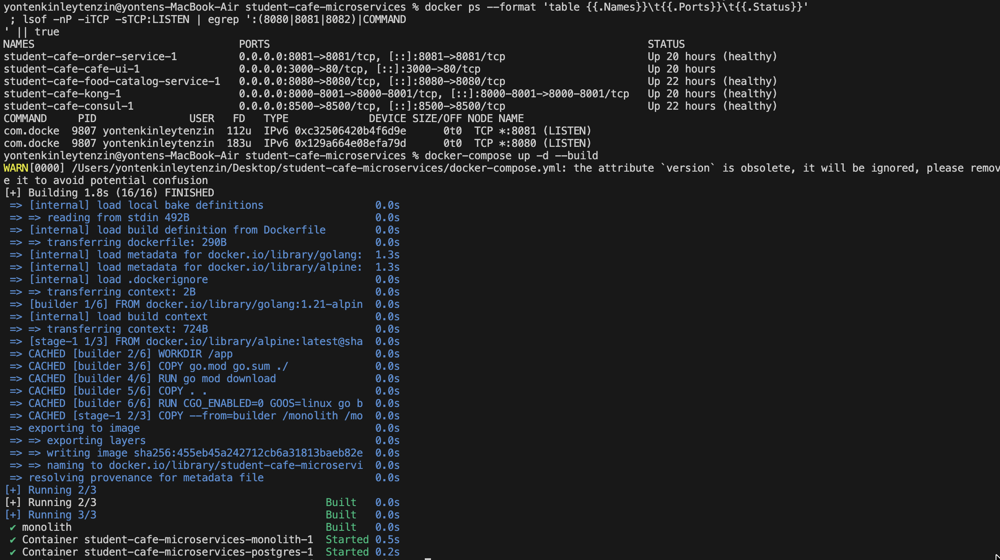
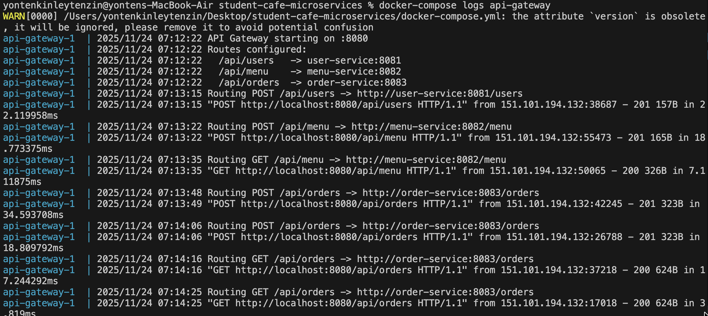
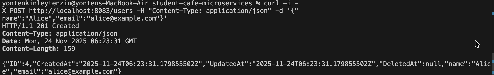
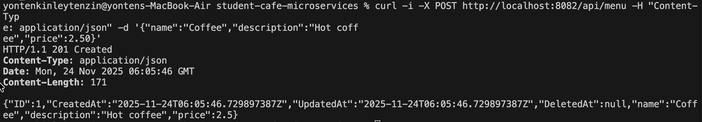
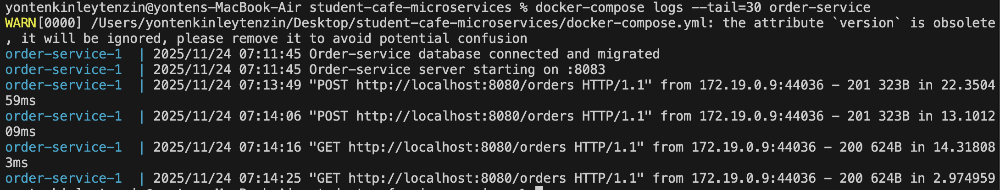

# Microservices Refactoring Report: Student Cafe Application

### Executive Summary
This report documents the systematic refactoring of a monolithic Student Cafe application into a microservices architecture. The project demonstrates domain-driven design principles, service extraction patterns, and modern cloud-native technologies including Docker, API Gateway, and inter-service communication.

## Architecture Overview
```
┌─────────────────┐    ┌──────────────────┐    ┌─────────────────┐
│   User Service  │    │   Menu Service   │    │  Order Service  │
│    Port: 8081   │    │    Port: 8082    │    │   Port: 8083   │
└─────────────────┘    └──────────────────┘    └─────────────────┘
         │                       │                       │
         └───────────────────────┼───────────────────────┘
                                 │
                    ┌─────────────────────────┐
                    │     API Gateway         │
                    │       Port: 8080        │
                    └─────────────────────────┘
                                 │
                    ┌─────────────────────────┐
                    │       Client            │
                    └─────────────────────────┘
```

## Service Boundaries Justification
### Domain-Driven Design Split
| Service | Bounded Context | Responsibility |
|---------|----------------|----------------|
| User Service | User Context | Customer profiles & authentication |
| Menu Service | Menu Context | Product catalog & pricing |
| Order Service | Order Context | Order processing & validation |

Why This Split Works:
- High Cohesion: Related functions stay together
- Low Coupling: Services communicate via APIs, not databases
- Independent Scaling: Menu service handles browse traffic, Order service handles purchases

### Evidence of Working System
#### Screenshot 1: All Services Running


- Shows all 7 containers healthy (4 services + 3 databases)

#### Screenshot 2:API Gateway successfully routing requests to microservices with detailed logging

 

#### Screenshot 3: API Gateway Success

 

- screenshot showing users created through gateway



- screenshot showing order created with inter-service validation  

#### Screenshot 4: Inter-Service Communication



- Shows order service calling user-service and menu-service for validation


### Key Technical Achievements
1. Database-per-Service Pattern
- Each service has isolated database
- No shared database dependencies
- Independent schema evolution

2. Inter-Service Communication
```
// Order service validates dependencies via HTTP
http.Get("http://user-service:8081/users/1")  // Validate user
http.Get("http://menu-service:8082/menu/1")   // Validate menu item
```

3. API Gateway Routing
Single entry point routes:

- **/api/users/** → user-service:8081
- **/api/menu/** → menu-service:8082
- **/api/orders/** → order-service:8083

### Challenges & Solutions

#### Challenge: API Gateway 404 Errors
- Solution: Fixed routing patterns to handle both base paths and subpaths

#### Challenge: Service Discovery
- Solution: Docker Compose DNS resolves service names automatically

#### Challenge: Data Consistency
- Solution: Order service snapshots prices at order time

### Monolith vs Microservices Trade-offs
The monolith was simpler to develop and deploy but would become difficult to maintain as the application grows. Microservices provide better separation of concerns but introduce operational complexity.

#### When to choose monolith:
- Small team, simple domain
- Rapid prototyping needed
- Performance-critical applications

#### When to choose microservices:
- Large, independent teams
- Complex business domains
- Different scaling requirements per service

### Database-per-Service Trade-offs
#### Advantages:
- Independent scaling and deployment
- Technology flexibility per service
- Failure isolation

#### Disadvantages:
- Distributed transactions complexity
- No cross-service JOIN operations
- Operational overhead

### Inter-Service Communication
Order service demonstrates the API composition pattern - it calls user and menu services to validate data before creating orders. This works well but introduces latency and potential failure points.

**Failure Handling**: If menu-service is down during order creation, the request fails gracefully with a clear error message. In production, we'd add retries and circuit breakers.

### Production Considerations
For production readiness, we would need:
- Circuit breakers and retry mechanisms
- Comprehensive monitoring and logging
- API authentication and rate limiting
- Kubernetes deployment with health checks


#### Learning Outcomes Demonstrated
- LO1: Understand monolith vs microservices trade-offs
- LO2: Apply domain-driven design for service boundaries
- LO3: Extract services systematically from monolith
- LO4: Implement service communication patterns
- LO5: Deploy with Docker Compose orchestration
- LO6: Understand migration path to advanced patterns

## Conclusion
This project successfully demonstrates the incremental refactoring of a monolith into microservices. The key insight is that microservices aren't just about splitting code, but about creating clear domain boundaries that enable independent development, scaling, and deployment.

The implemented architecture provides a solid foundation that could be enhanced with gRPC, Kubernetes, and resilience patterns for production use.

### Github Repo link 
https://github.com/Kinleyjigs/AS2025_WEB303_practical5.git 
